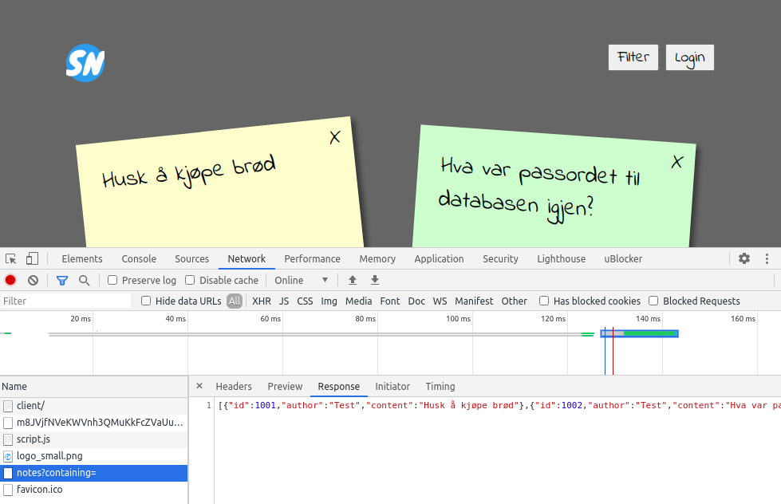
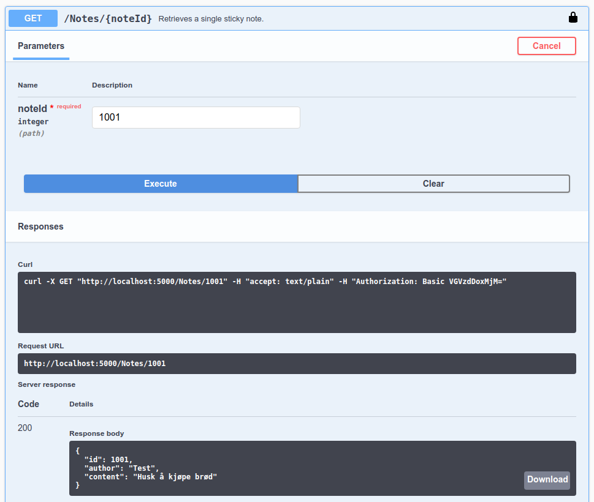
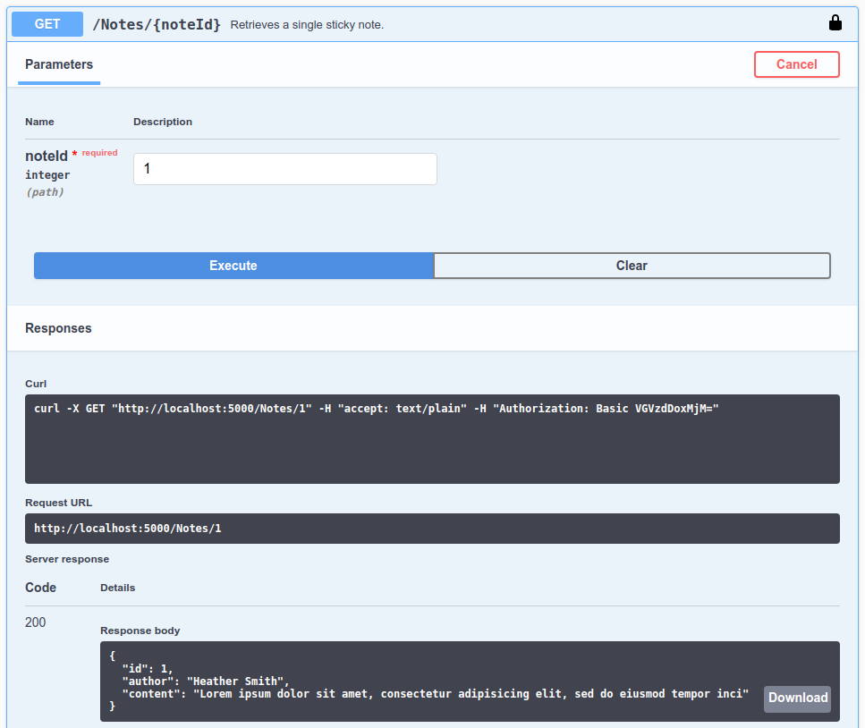

2 Broken Access Control
=======================
[Broken access control](https://owasp.org/Top10/A01_2021-Broken_Access_Control/) is the top vulnerability on OWASP Top 10, and it's an issue that can manifest itself in a number of ways:
* Attackers could be bypassing access control checks by modifying the URL, internal application state, or the HTML page itself.
* Attackers could be elevating their user privileges, for instance using a common user account as an admin account and so on.
* Attackers could be exploiting CORS misconfiguration allows unauthorized API access.
* And more.

Many access control issues stems from the application developer forgetting to check that an authenticated user actually is authorized to view some particular data, and this is the kind of broken access control issue that we'll be exploring in this section.

The Fault
---------
Notes.Api is able to retrieve single notes by supplying an note ID, but as we'll see, this functionality hasn't been implemented properly.

### Retrieving your own note
Open Notes.Client in browser and login if you're not already authorized. Open the browser developer tools, and view the network traffic. Find the request to Notes.Api that retrieves all notes for your user.



See how every note has an ID? Make a note of one of your ID's, then head over to Swagger UI.

Notes.Api supports retrieving a single note by using GET /Notes/{noteId}. Let's try it out with the ID we found.



Seems like that works. All good so far, but can this be exploited?

### Retrieving other users notes
Let's try retrieving notes with some other ID's. One good place to start is to use ID=1.



That worked as well! Seems like someone have forgotten to check that users should only be able to access notes they have written themselves.

The Fix
-------
In our case, users should not be able to view notes written by other authors, so we need to ensure that the API only returns notes written by the authorized user.

One way of fixing this issue is to open [Notes.Api/Controllers/NotesController.cs](../Notes.Api/Controllers/NotesController.cs) and add some code to `public ActionResult<Note> Get([FromRoute] int noteId)`, that checks that the authorized user is the author of the note we found in the database:

```csharp
var authorizationHeader = Request.Headers["Authorization"];
var user = BasicAuthenticationHandler.GetUserFrom(authorizationHeader);
if (note.Author != user.Username)
{
    return Forbid();
}
```

With this update, we should be getting "403 Error: Forbidden" when we try to access notes that we haven't authored. You can test it out with Swagger UI.

The Reflection
--------
In this part you'll reflect over the security vulnerability found in Sticky Notes locally on your machine. After each step, reflect on what you have learned, what risks the vulnerability entails and how it can be prevented in the future. 
